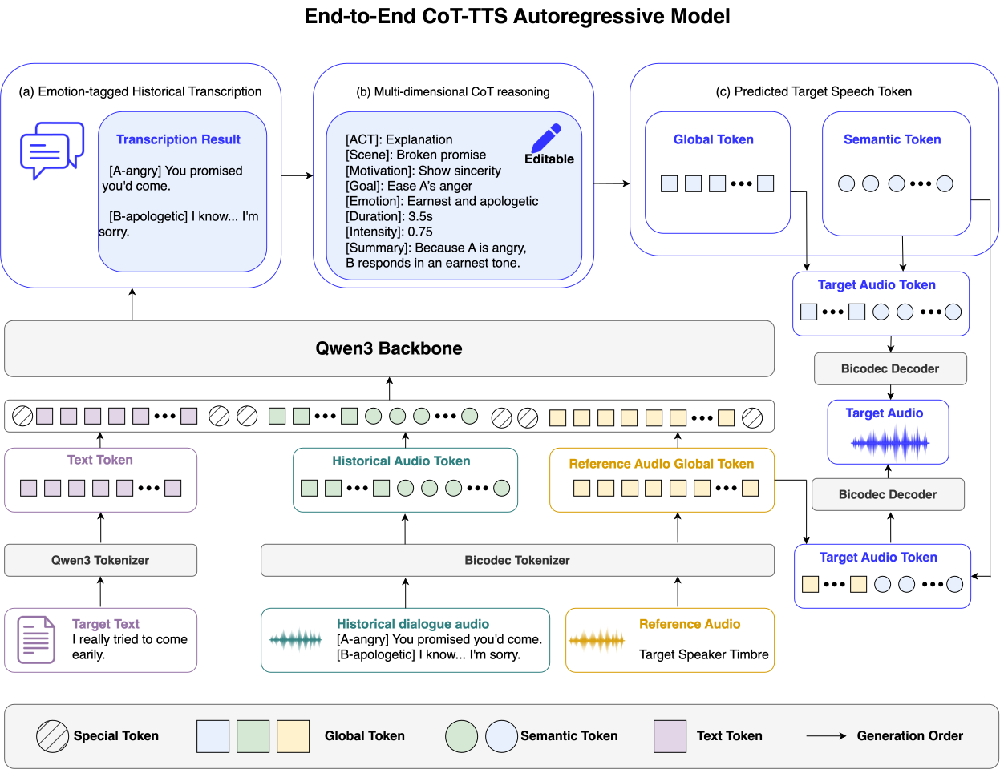
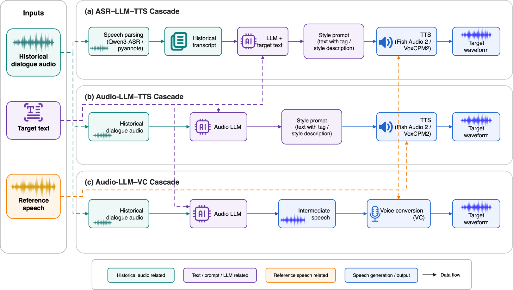

# COT-TTS Demo Gallery

This folder contains a self-contained static website for the COT-TTS demo gallery.

COT-TTS studies context-aware reasoning speech generation. Given historical dialogue audio, target text, and a reference speaker utterance, the system first understands the dialogue context, then produces explicit chain-of-thought reasoning about the intended speaking manner, and finally generates target speech with the target speaker timbre.

The demo page gives a lightweight overview of the project and provides listening examples for both the model and baseline systems.

## Model Overview

### Model



### Baseline



## Open Resources

- Proposal: https://arxiv.org/abs/2606.21933
- Challenge website: https://iscslp2026-cot-tts.github.io/challenge-website/
- Training Dataset: https://huggingface.co/datasets/HKUSTAudio/ISCSLP2026-CoT-TTS
- Open-source model: https://github.com/LuckyBian/COT-TTS/tree/main/infer
- Training code: https://github.com/LuckyBian/COT-TTS/tree/main/train
- Challenge baseline: https://github.com/iscslp2026-cot-tts/baseline

## Local Preview

```bash
python -m http.server 8898
```

Then open:

```text
http://localhost:8898
```

## GitHub Pages

Upload all files in this folder to a GitHub repository. The entry file is:

```text
index.html
```

No backend or build step is required.
